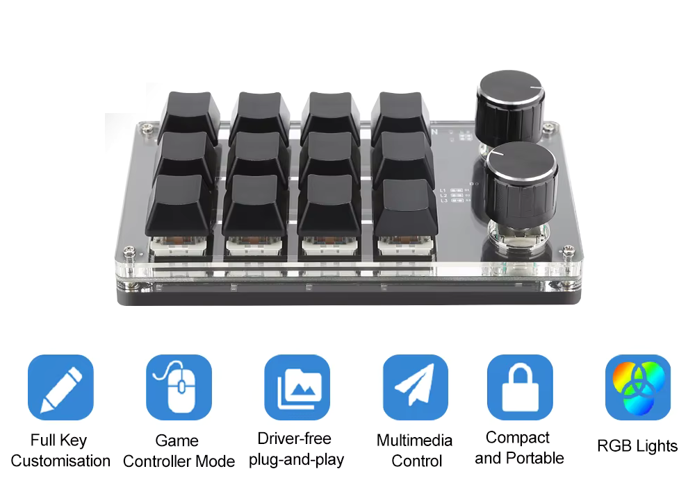
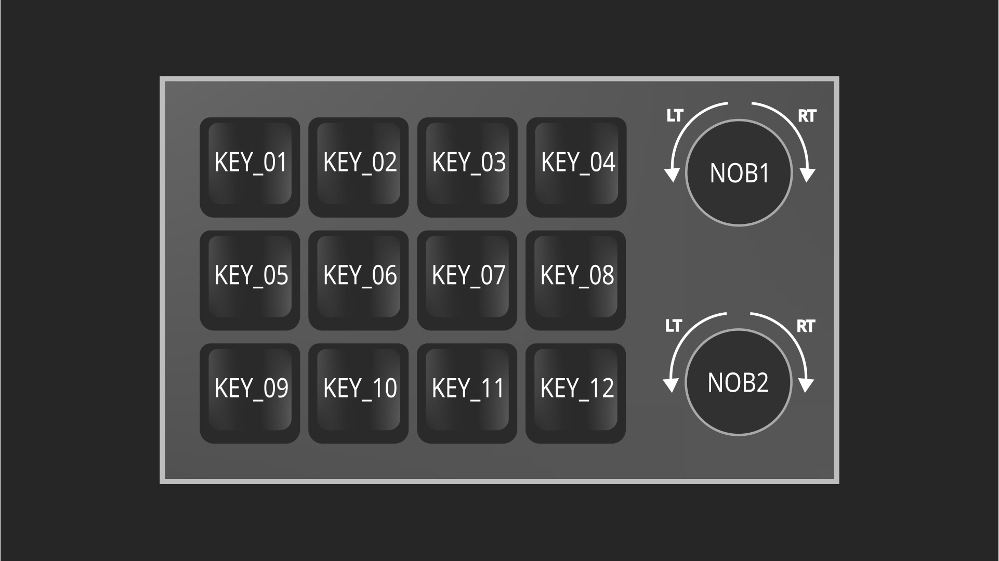

Romoral Macropad driver
===============
The romopad-driver is a user-space level driver for Romoral macropad.</br>

The default keylayout of Romoral macropad is not very useful and there're no official drivers for linux</br>
This driver aims to aid that, the driver utilizes python-evdev to detect and remap key events sent by the macropad.</br>

>[!NOTE]
> Romoral macropad uses generic Acer device identification.</br>
> This may cause the driver to remap other devices with the same id.</br>
> Some Acer and generic devices.</br>

## 🎯 Scope
- Target device: Romoral factory 12 key macropad
- OS: Linux 
- Display servers: `Wayland | Xorg (untested)`


## ✨ Features
- layout layers
- layout layer indicator
- keyboard signals
- mouse signals
- command execution


## Dependencies
 - Python
 - Pip
 - python-evdev (automatically fetched by venv)
 - make


## 📦 Installation
> [!CAUTION]
> Under no circumtances should this program be run with root privileges.</br>
> Failing to do so opens you to privilege escalation threat.</br>

> [!IMPORTANT]
> Make sure you're in the "input" user group, otherwise the driver won't work.</br></br>
> You can add yourself using following commands:
> - [Arch,Fedora,rhel]: `sudo usermod -aG input $USER`</br>
> - Debian: `sudo useradd -a G input $USER`

To install execute following commands:

```bash
$ git clone https://github.com/Sora-3e8/romopad-driver
$ cd romopad-driver
$ sudo make install
$ systemctl --user daemon-reload
$ systemctl --user enable --now romopad.service
```
## Usage
The user-space driver should immidiately be activated after the install
- You can check the status using: `systemctl --user status romopad-service`
- To enable: `systemctl --user enable --now romopad-service`
- To disable: `systemctl --user disable --now romopad-service`

## 🐞 Known issues
- In some environments the layer indicator may not show up, this is an issue caused by systemd not being able to pass the display variable as it was not set yet
- This occurs for example in wm managers as it's impossible to tell if session has already started
- The usual quick fix is to restart the service after logging into session:<br/>
  ```bash
  $ systemctl --user restart romopad.service
  ```
- For this reason it's highly recommended for wm manager sessions, to start the service using the wm itself
- Example Hyprland: `exec-once = systemctl --user start romopad.service`

- The indicator now depends on the Xorg due to Tkinter being dependent, currently there're plans to replace it with Gtk4.
  however that's still a bit far, but it will be needed to be done as Xorg is being phased out.
- This may affect users on Niri which does not directly use XWayland, but the xwayland-satellite. 


## 🔧 Configuration
  The configuration uses xml format: `layout --> layer --> bind` </br>

### Default config
- Default config path is `~/.config/romopad/layout.xml`
- On install default `numpad layout` config is copied into your config path.

### Config layout
- Every config must have main node: `<layout>`</br>
- All layers are to be inside the layout node</br>
- Configuration is defined by layers and each configuration must have at least one non-static layer</br>
- The static layer is optional
- Binds in both static and non-static layer are optional

### Layers
- Configuration has two layer types `<layer>|<static-layer>`</br>
  
- `<layer>` - Switchable layer, each layer has mandatory unique attribute `id`, switched by `layer_control` bind</br>

- `<static-layer>` - Static layer, cannot be swiched, only one should be defined, if more than one set the last one will be used

### Keybinds
- Each keybind is to be defined in layer, if the layer is `<static-layer>`, the binds will persist across all layers.</br>
  
- Bind has a mandatory attributes: `keys, type`</br>

  
  `keys` attribute - Are the physical key you're mapping (multiple keys are not currently supported)</br>
  `type` attribute - The type of action that they bound key will perform
  - `key` - maps physical key to your key example: `<bind keys="KEY_01" type="key" >KEY_KP0</bind>`
  - `command` - maps key to run command example: `<bind keys="KEY_01" type="command" >notify-send "Hello"</bind>`
  - `layer_control` - maps key to control layer switching, values `prev|next`</br> example: `<bind ... type="layer_control" >next</bind>`

>[!TIP]
> You can find available keycodes in <a href="https://github.com/torvalds/linux/blob/master/include/uapi/linux/input-event-codes.h">input-event-code</a></strong> header</br>
> No need to be an expert, general rule of thumb use keycodes which start like `KEY_`


### Example configuration:
```xml
<?xml version="1.0" encoding="UTF-8"?>
<layout>
  <static-layer>
      <bind keys="NOB1" type="key">KEY_MUTE</bind>
      <bind keys="NOB1_LT" type="key">KEY_VOLUMEDOWN</bind>
      <bind keys="NOB1_RT" type="key">KEY_VOLUMEUP</bind> 
      <bind keys="NOB2_LT" type="layer_control">prev</bind>
      <bind keys="NOB2_RT" type="layer_control">next</bind>
  </static-layer>
  <!--This layer behaves like numpad-->
  <layer id="0">
      <bind keys="KEY_01" type="key">KEY_NUMLOCK</bind>
      <bind keys="KEY_05" type="key">KEY_KPDOT</bind>
      <bind keys="KEY_09" type="key">KEY_KP0</bind>
      <bind keys="KEY_10" type="key">KEY_KP1</bind>
      <bind keys="KEY_11" type="key">KEY_KP2</bind>
      <bind keys="KEY_12" type="key">KEY_KP3</bind>
      <bind keys="KEY_06" type="key">KEY_KP4</bind>
      <bind keys="KEY_07" type="key">KEY_KP5</bind>
      <bind keys="KEY_08" type="key">KEY_KP6</bind>
      <bind keys="KEY_02" type="key">KEY_KP7</bind>
      <bind keys="KEY_03" type="key">KEY_KP8</bind>
      <bind keys="KEY_04" type="key">KEY_KP9</bind>
  </layer>
  <layer id="AppLauncher">
    <bind keys="KEY_01" type="command">exec nautilus</bind>
    <bind keys="KEY_02" type="command">exec $BROWSER</bind>
    <bind keys="KEY_03" type="command">exec notify-send "Macropad" "$(cowsay 'Moo from your macropad.')"</bind> 
  </layer>
</layout>
```

## Device layout
- Physical layout of keys for reference</br></br>
  

## Uninstall
To remove execute as root:
```bash
$ systemctl --user disable --now macroboard_driver.service
$ sudo make uninstall
```
